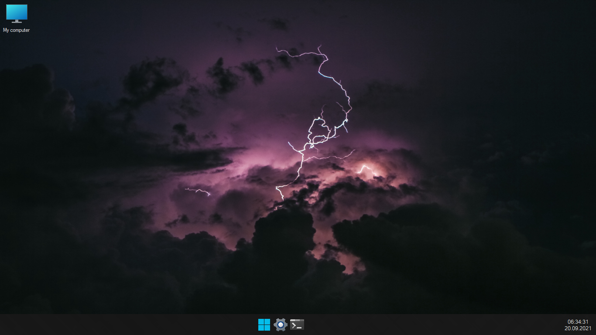

# Welcome to Vega
Vega is a Windows Explorer. It provides convenience with various innovations it offers.

## Contributors

Thanks goes to these wonderful people ([emoji key](https://allcontributors.org/docs/en/emoji-key)):

<table>
  <tr>
    <td align="center">
		<a href="https://github.com/Taiizor">
			
			<br/>
			<sub>
				<b>Taiizor</b>
			</sub>
		</a>
		<br/>
		<a href="https://github.com/Soferity/Vega/commits?author=Taiizor" title="Code">💻</a>
		<a href="https://www.vegalya.com" title="Ideas & Planning, Feedback">🤔</a>
	</td>
  </tr>
</table>

This project follows the [all contributors](https://github.com/all-contributors/all-contributors) specification. Contributions of any kind welcome!

## Backers

<table>
  <tr>
    <td align="center">
		<a href="https://github.com/Soferity">
			
			<br/>
			<sub>
				<b>Soferity</b>
			</sub>
		</a>
		<br/>
		<a href="https://github.com/Soferity" target="_blank" title="Content">🖋</a>
	</td>
  </tr>
</table>

## Usage

Step 1：Add a reference to Vega or search for Vega on the NuGet;

```Install-Package Vega```

Step 2：Enjoy manages

## Demos

### Vega

[](https://github.com/Aquilatery/Vega/tree/develop/src "Vega")